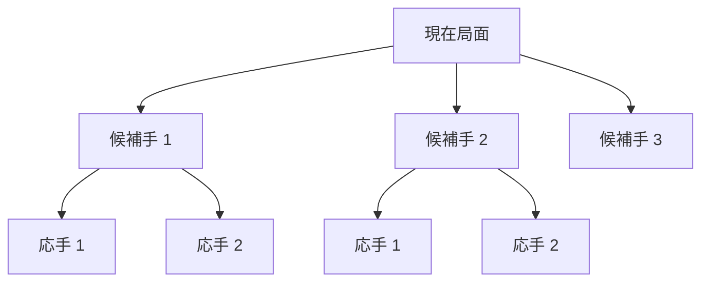
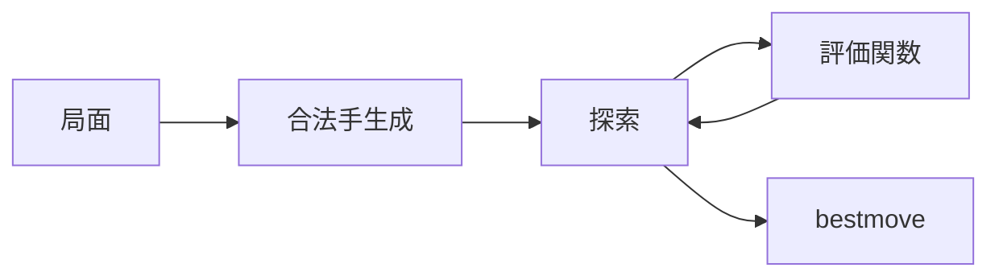
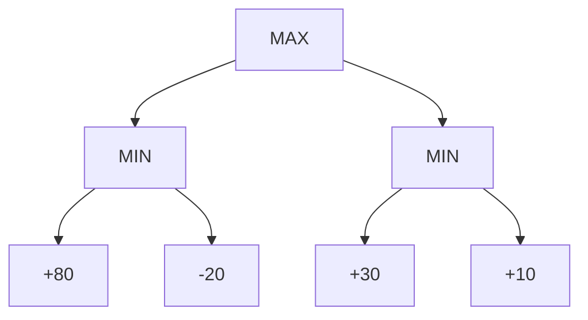
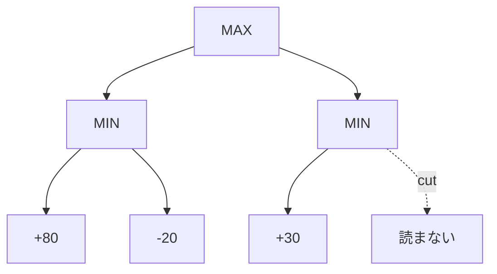
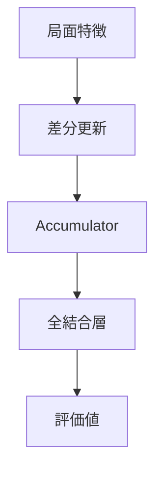
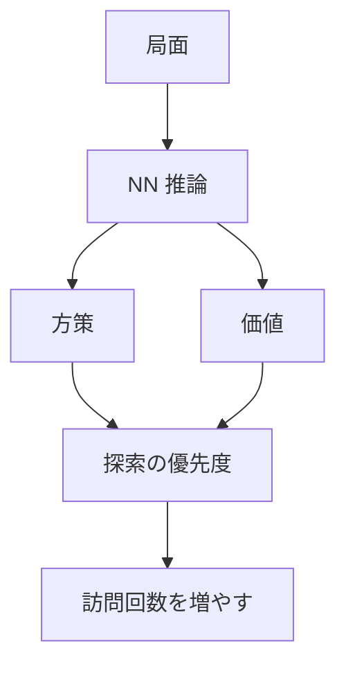
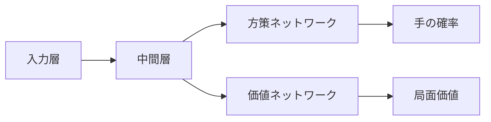

  
第36回世界コンピュータ将棋選手権 1日目 お昼休憩 特別講演

  <h1>将棋 AI の概要と最新動向</h1>
  
探索・評価関数・定跡から見るコンピュータ将棋

  

    

      
野田 久順

      
ザイオソフト コンピューター将棋サークル

      
2026-05-03

    

  

---
layout: section
---

# 1. 自己紹介

---
layout: image-right-framed
image: assets/S0650008697-0024-clipped-Hisayori-Noda.jpg
backgroundSize: contain
columns: 1.8fr 0.2fr
frameMaxWidth: 320px
frameMaxHeight: 280px
---

## 野田 久順

ザイオソフト <NW>コンピューター</NW><NW>将棋</NW><NW>サークル</NW><NW>所属</NW>

### 主な実績
- 2017年 <NW>第5回</NW><NW>将棋</NW><NW>電王</NW><NW>トーナメント</NW> <NW>優勝</NW>
- 2021年 <NW>CSA</NW><NW>貢献賞</NW> <NW>受賞</NW>
- 2024年 <NW>第34回</NW><NW>世界</NW><NW>コンピュータ</NW><NW>将棋</NW><NW>選手権</NW> <NW>優勝</NW>

---
layout: center
---

## 今日持ち帰ってほしいこと

1. <NW>将棋 AI</NW> は <NW>探索</NW> と <NW>評価</NW> の組み合わせで強くなる
2. <NW>CPU エンジン</NW> と <NW>GPU エンジン</NW> は設計思想がかなり違う
3. 最新動向は <NW>評価関数の大型化</NW> と <NW>定跡の大規模化</NW>

---
layout: two-cols
columns: 1fr 1fr
---

## この発表の流れ

::left::
- 1. <NW>自己紹介</NW>
- 2. <NW>将棋 AI の概要</NW>
  - ゲーム木
  - 探索量と複雑さ
  - 探索と評価

::right::
- 3. <NW>将棋 AI のアーキテクチャー</NW>
  - CPU エンジン
  - GPU エンジン
  - 定跡
- 4. <NW>最新動向</NW>
  - SFNN
  - 新ペタショック定跡

---
layout: section
---

# 2. 将棋 AI の概要

---
layout: image-right-framed
image: assets/2026-02-27-111526.png
backgroundSize: contain
columns: 1.45fr 0.55fr
frameMaxWidth: 420px
frameMaxHeight: 320px
---

## 将棋 AI とは

<NW>現在の局面</NW>から、<NW>次に指す手</NW>を選ぶプログラム。

### 強さを作る主な部品
- <NW>合法手生成</NW>: 指せる手を列挙する
- <NW>探索</NW>: 先の局面を読む
- <NW>評価関数</NW>: 局面の良さを数値化する
- <NW>定跡</NW>: 序盤で既知の良い手を使う
- <NW>時間管理</NW>: 持ち時間を配分する

---
layout: two-cols
columns: 1fr 1fr
---

## ゲーム木

::left::
将棋では、1手指すごとに複数の応手があり、局面は木のように広がる。

::right::
### 読み切れない理由
- 分岐が多い
- 終局までが長い
- 持ち駒で合法手が増える
- 時間制限がある

そこで、<NW>全部読む</NW>のではなく、<NW>重要そうなところ</NW>を重点的に読む。

---
layout: two-cols
columns: 1fr 1fr
---

## 探索量から見たゲームの複雑さ

::left::
### ざっくりした増え方

平均分岐数を `b`、読む深さを `d` とすると、単純には

`b^d`

だけ局面が増える。

::right::
### 例

| 平均分岐数 | 深さ | 局面数 |
|---:|---:|---:|
| 30 | 4 | 約 81万 |
| 30 | 6 | 約 7.3億 |
| 30 | 8 | 約 6,561億 |

<NW>深さを少し増やす</NW>だけで、必要な計算量は急増する。

---
layout: two-cols
columns: 1fr 1fr
---

## 探索と評価

::left::

::right::
### 探索
- どの変化を読むか決める
- 悪そうな枝を早めに捨てる
- 時間内に最善手を探す

### 評価
- 読みの末端局面に点数を付ける
- 駒得、玉の安全、攻めの速度などを反映する

---
layout: section
---

# 3. 将棋 AI のアーキテクチャー

---
layout: center
---

## CPU エンジンと GPU エンジン

| 観点 | CPU エンジン | GPU エンジン |
|---|---|---|
| 探索 | アルファ・ベータ探索 | MCTS / PUCT |
| 評価 | NNUE などの高速評価 | 深いニューラルネットワーク |
| 得意 | 大量の分岐を細かく刈る | 大きな NN をまとめて評価 |
| 代表的な呼び方 | NNUE系 | DL系 |

どちらも「探索」と「評価」の組み合わせだが、計算資源の使い方が違う。

---
layout: section
---

# CPU エンジン

---
layout: two-cols
columns: 1fr 1fr
---

## ミニマックス法

::left::
自分は評価値を最大化し、相手は評価値を最小化すると考える。

::right::
### 考え方
- 自分番: 一番良い手を選ぶ
- 相手番: 相手にとって一番良い手を選ばれる
- 完全情報ゲームと相性が良い

ただし、そのままだと読む局面数が多すぎる。

---
layout: two-cols
columns: 1fr 1fr
---

## アルファ・ベータ法

::left::
ミニマックスと同じ結果を保ちながら、結論に影響しない枝を読まない。

::right::
### 効果
- 良い手順に早く当たるほど枝刈りが効く
- move ordering が非常に重要
- 反復深化、置換表、静止探索などと組み合わせる

CPU エンジンはこの周辺技術の積み上げで強くなってきた。

---
layout: two-cols
columns: 1fr 1fr
---

## NNUE 評価関数

::left::
NNUE は、CPU 上で高速に動くように設計されたニューラルネットワーク評価関数。

### 特徴
- 入力は疎な特徴量
- 1手ごとの差分で更新できる
- 整数演算で高速に推論できる

::right::

探索量を落とさず、評価を賢くするための仕組み。

---
layout: two-cols
columns: 1fr 1fr
---

## 全結合ニューラルネットワーク

::left::
NNUE の中核は全結合層。

入力ベクトルに重みを掛け、バイアスを足して、次の層へ渡す。

`y = W x + b`

::right::
### 将棋 AI で難しい点
- 入力候補が多い
- 探索中に何百万回も評価する
- 毎回ゼロから計算すると遅い

だから NNUE では、<NW>疎な入力</NW>と<NW>差分更新</NW>が効く。

---
layout: image-right-framed
image: assets/HalfKP.png
backgroundSize: contain
columns: 1.35fr 0.65fr
frameMaxWidth: 440px
frameMaxHeight: 330px
---

## HalfKP 特徴量

玉の位置と、盤上の駒・持ち駒の組み合わせで特徴を作る。

### 直感
- 王様の位置が変わると、駒の価値も変わる
- 攻め駒か守り駒かは玉との関係で決まる
- 局面の差分だけを更新しやすい

NNUE の速さは、特徴設計と実装最適化の両方で支えられている。

---
layout: section
---

# GPU エンジン

---
layout: two-cols
columns: 1fr 1fr
---

## GPU エンジンの探索アルゴリズム

::left::
GPU エンジンでは、深いニューラルネットワークの出力を使いながら探索することが多い。

### 代表例
- MCTS
- PUCT
- 方策ネットワーク
- 価値ネットワーク

::right::

---
layout: two-cols
columns: 1fr 1fr
---

## PUCT

::left::
PUCT は、よく勝てそうな手と、まだ十分調べていない手のバランスを取る。

### 使う情報
- これまでの平均価値
- 訪問回数
- 方策ネットワークの事前確率

::right::
### ざっくり言うと

`選びたい度 = 実績 + 未探索ボーナス`

方策が「有望」と言う手は早めに試す。
ただし、実際に悪ければ探索の中で評価が下がる。

---
layout: two-cols
columns: 1fr 1fr
---

## GPU エンジンの評価関数

::left::
GPU エンジンの評価関数は、局面を入力して複数の出力を返す。

### 主な出力
- <NW>方策</NW>: 各指し手の有望度
- <NW>価値</NW>: 勝敗や期待値

::right::

---
layout: two-cols
columns: 1fr 1fr
---

## GPU エンジンのネットワーク例

::left::
### 入力層
- 盤上の駒
- 持ち駒
- 手番
- 王手、千日手などの補助情報

### 中間層
- 畳み込み層や ResNet ブロック
- 盤面全体の形を抽出する

::right::
### 方策ネットワーク
- 合法手ごとの有望度を出す
- 探索でどの手から読むかに効く

### 価値ネットワーク
- 局面の勝ちやすさを出す
- ロールアウトの代わりに使う

---
layout: two-cols
columns: 1fr 1fr
---

## 定跡

::left::
定跡は、序盤局面に対する事前計算済みの知識。

### 役割
- 序盤で時間を節約する
- 悪い変化に入るのを避ける
- 深く調べた変化を実戦に持ち込む

::right::
### 現代的な使われ方
- エンジンで大量に局面を掘る
- minimax 化して整合性を取る
- 相手や持ち時間に応じて使い方を変える

定跡も、いまでは巨大な探索結果のデータベースになっている。

---
layout: section
---

# 4. 最新動向

---
layout: image-right-framed
image: assets/SFNNv9_architecture_detailed_v2.Bw_vbb_h.svg
backgroundSize: contain
columns: 1fr 1fr
frameMaxWidth: 520px
frameMaxHeight: 360px
---

## SFNN

Stockfish 系 NNUE の進化で、大きめの特徴変換器や LayerStack 的な構成が使われるようになっている。

### 将棋 AI から見るポイント
- NNUE はまだ CPU エンジンの主戦場
- ネットワークを大きくすると評価は賢くなる
- ただし探索中に何度も呼ぶので速度との勝負

将棋側でも、SFNN 系の設計をどう取り込むかが重要になる。

---
layout: two-cols
columns: 1fr 1fr
---

## 新ペタショック定跡

::left::
やねうら王チーム周辺で公開・配布されている、大規模な将棋定跡。

### 近年の特徴
- 数百万局面規模
- 1局面を大きなノード数で探索
- 定跡ツリーを minimax 的に整理

::right::
### 何が新しいか
- 次に掘る frontier nodes を選ぶ
- 自分番は bestmove を選ぶ前提にする
- 相手番は評価差の範囲で複数手を許す

組み合わせ爆発を抑えながら、実戦で出やすい深い変化を掘る。

---
layout: two-cols
columns: 1fr 1fr
---

## 最新動向を一言で

::left::
### 評価関数
- CPU: NNUE / SFNN 系の大型化
- GPU: 方策・価値ネットワークの高精度化
- 速度と精度の両立が中心課題

::right::
### 探索と定跡
- 探索は「全部読む」から「読むべき所を読む」へ
- 定跡は人間の知識から大規模探索結果へ
- 大会では定跡運用も重要な戦略

---
layout: section
---

# 5. まとめ

---
layout: center
---

## まとめ

1. <NW>将棋 AI</NW> は <NW>探索</NW> と <NW>評価</NW> を組み合わせて手を選ぶ
2. <NW>CPU エンジン</NW> はアルファ・ベータ探索と NNUE が中心
3. <NW>GPU エンジン</NW> は PUCT と方策・価値ネットワークが中心
4. 最新動向は <NW>SFNN</NW> と <NW>大規模定跡</NW> が見どころ

---
layout: center
---

## 参考

- コンピュータ将棋協会: 第36回世界コンピュータ将棋選手権 日程
- やねうら王公式: 新ペタショック定跡の定跡生成アルゴリズムについて
- やねうら王 GitHub / Wiki: エンジン種別と NNUE 系・DL 系の説明
- Stockfish NNUE PyTorch docs: NNUE と SFNN 系アーキテクチャー

---
layout: end
---

# ご清聴ありがとうございました
