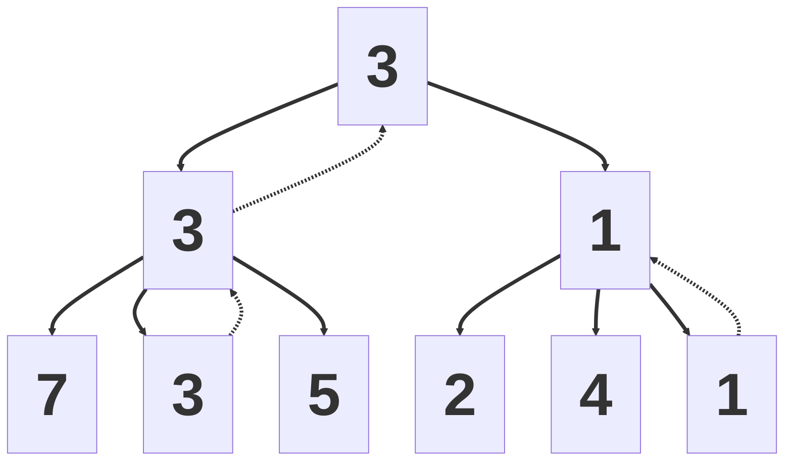
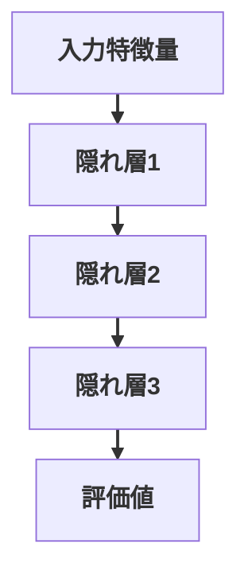
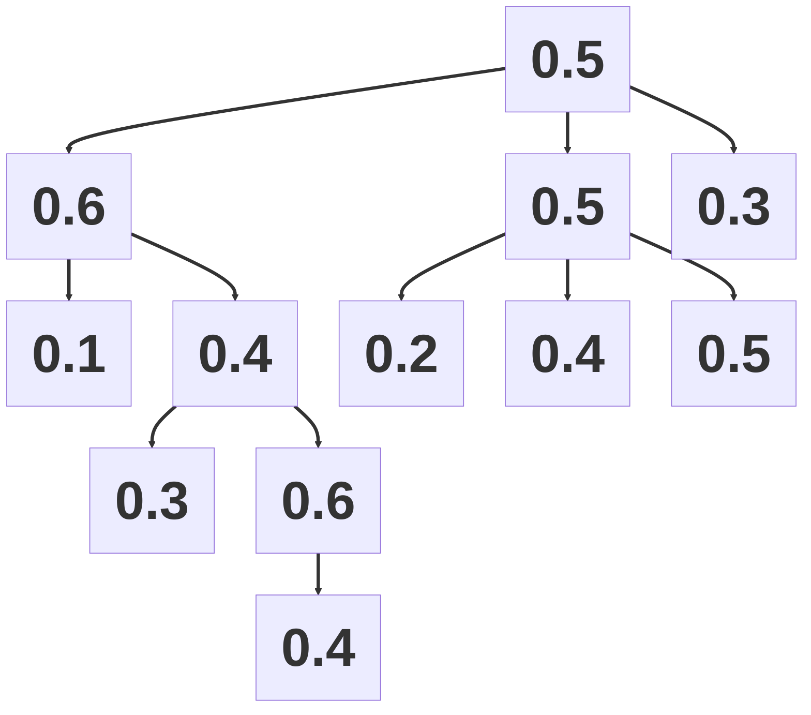
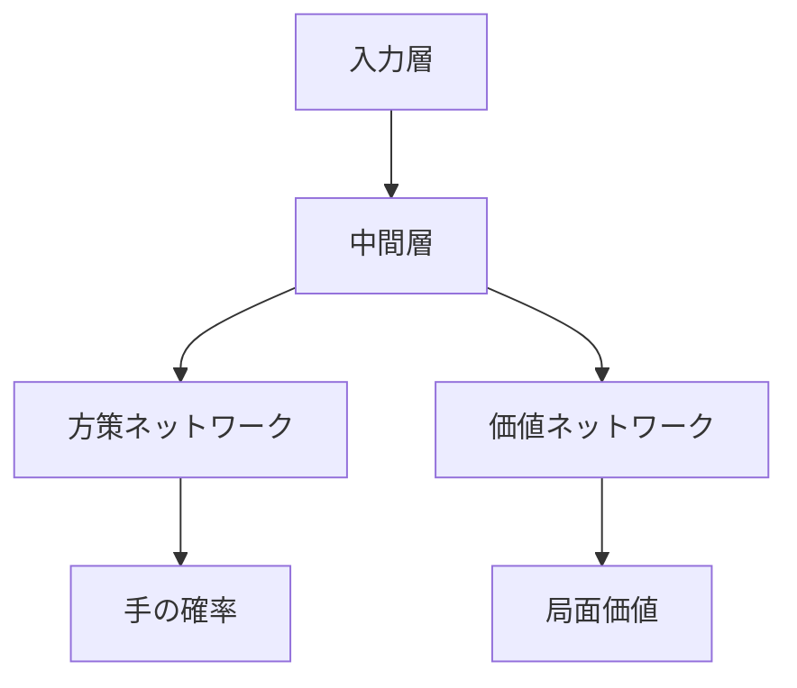
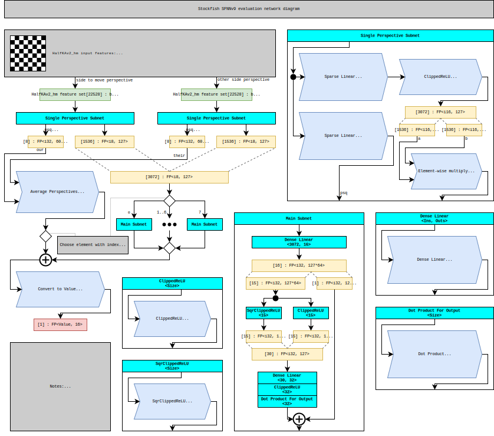

<div class="eyebrow">第36回世界コンピュータ将棋選手権 1日目 お昼休憩 特別講演</div>
<h1>将棋 AI の概要と最新動向</h1>
<p class="subtitle">探索・評価関数・定跡から見るコンピュータ将棋</p>
<div class="meta">
  <div>
    <div>野田 久順</div>
    <div class="muted">ザイオソフト コンピューター将棋サークル</div>
    <div class="muted">2026-05-03</div>
  </div>
</div>

---
layout: section
---

# 1. 自己紹介

---
layout: two-cols
columns: 1.5fr 0.5fr
---

## 野田 久順

:: left ::
ザイオソフト <NW>コンピューター</NW><NW>将棋</NW><NW>サークル</NW><NW>所属</NW>

### 主な実績
- 2017年 <NW>第5回</NW><NW>将棋</NW><NW>電王</NW><NW>トーナメント</NW> <NW>優勝</NW>
- 2021年 <NW>CSA</NW><NW>貢献賞</NW> <NW>受賞</NW>
- 2024年 <NW>第34回</NW><NW>世界</NW><NW>コンピュータ</NW><NW>将棋</NW><NW>選手権</NW> <NW>優勝</NW>

::right::


---
layout: center
---

## 今日持ち帰ってほしいこと

1. <NW>将棋 AI の</NW><NW>全体像</NW><NW>（探索・評価）</NW>
2. <NW>CPU エンジン</NW><NW>と</NW><NW>GPU エンジン</NW>
3. <NW>最新動向</NW>

---
layout: two-cols
columns: 1fr 1fr
---

## この発表の流れ

::left::
- 1. <NW>自己紹介</NW>
- 2. <NW>将棋 AI の概要</NW>
  - ゲーム木
  - 探索量と複雑さ
  - 探索と評価

::right::
- 3. <NW>将棋 AI のアーキテクチャー</NW>
  - CPU エンジン
  - GPU エンジン
  - 定跡
- 4. <NW>最新動向</NW>
  - SFNN
  - 新ペタショック定跡

---
layout: section
---

# 2. 将棋 AI の概要

---
layout: image-right-framed
image: assets/2026-02-27-111526.png
backgroundSize: contain
columns: 1.3fr 0.7fr
frameMaxWidth: 280px
frameMaxHeight: 220px
---

## 将棋 AI とは

- <NW>将棋を</NW><NW>指す</NW><NW>ソフトウェア</NW>
- <NW>局面を</NW><NW>入力すると、</NW><NW>推奨手や</NW><NW>評価値を</NW><NW>提示</NW>
  - <NW>推奨手:</NW> <NW>次に</NW><NW>指すべき指し手</NW>
  - <NW>評価値:</NW> <NW>先手・後手の</NW><NW>有利さを</NW><NW>示す</NW><NW>数値</NW>

::right::
[ShogiHome](https://sunfish-shogi.github.io/shogihome/)

---
layout: two-cols
class: game-tree
columns: 1.3fr 0.7fr
---

## ゲーム木

::left::
- <NW>合法手に</NW><NW>基づいて、</NW><NW>局面遷移を</NW><NW>木構造で</NW><NW>表したもの</NW>
- <NW>ゲームの</NW><NW>状態遷移を</NW><NW>原理的に</NW><NW>すべて</NW><NW>表現できる</NW>
- <NW>すべての</NW><NW>分岐を</NW><NW>調べ切ると、</NW><NW>最善手同士の</NW><NW>結果を</NW><NW>特定できる</NW>
- <NW>この</NW><NW>過程を</NW><NW>「ゲームを解く」</NW><NW>と呼ぶ</NW>

::right::

```mermaid
%%{init: {'flowchart': {'useMaxWidth': true}}}%%
flowchart TD
  A@{ img: "./assets/image4.png", h: 110, constraint: "on" } --> B1@{ img: "./assets/image6.png", h: 110, constraint: "on" }
  A --> B2@{ img: "./assets/image5.png", h: 110, constraint: "on" }
  B1 --> C1@{ img: "./assets/image8.png", h: 110, constraint: "on" }
  B1 --> C2@{ img: "./assets/image7.png", h: 110, constraint: "on" }
  B2 --> C3[...]
  C1 --> D1@{ img: "./assets/image9.png", h: 110, constraint: "on" }
  C1 --> D2@{ img: "./assets/image10.png", h: 110, constraint: "on" }
  C2 --> D3[...]
  D1 --> E1[...]
  D2 --> E2[...]

  linkStyle default stroke-width:2px;
```

---
layout: two-cols
class: game-complexity
columns: 1.3fr 0.7fr
---

## 探索量から見たゲームの複雑さ

::left::
- <NW>ゲームを</NW><NW>解くための</NW><NW>探索局面数は、</NW><NW>複雑さの</NW><NW>目安になる</NW>
- <NW>探索局面数</NW><NW>≒</NW><NW>N<sup>M</sup></NW>
  - <NW>N:</NW><NW>平均合法手数</NW>
  - <NW>M:</NW><NW>平均終了手数</NW>
- <NW>複雑な</NW><NW>ゲームでは、</NW><NW>現実的な</NW><NW>時間内に</NW><NW>全探索は</NW><NW>不可能</NW>

::right::

| ゲーム | 探索局面数 |
| --- | --- |
| チェッカー | 10<sup>30</sup> |
| オセロ | 10<sup>60</sup> |
| チェス | 10<sup>120</sup> |
| 中国象棋 | 10<sup>150</sup> |
| 将棋 | 10<sup>220</sup> |
| 囲碁 | 10<sup>360</sup> |

---
layout: two-cols
class: search-eval
columns: 1.3fr 0.7fr
---

## 探索と評価

::left::
- <NW>一定の</NW><NW>手数まで</NW><NW>「探索」し、</NW><NW>到達局面を</NW><NW>「評価」する</NW>
  - <NW>探索:</NW> <NW>人間の</NW><NW>「読み」に</NW><NW>相当</NW>
  - <NW>評価:</NW> <NW>人間の</NW><NW>「大局観」に</NW><NW>相当</NW>

::right::



<div style="text-align:center; margin-top: 10px; font-size: 18px; line-height: 1.25">
  <NW>□:</NW> <NW>局面</NW><br>
  <NW>□の中の数字:</NW> <NW>評価値</NW><br>
  <NW>実線:</NW> <NW>差し手（遷移）</NW><br>
  <NW>破線:</NW> <NW>評価値の伝搬</NW><br>
  <NW>左側の</NW><NW>状態に</NW><NW>遷移する</NW><NW>手が</NW><NW>最善</NW><br>
  <NW>この時の</NW><NW>評価値は</NW><NW>3</NW>
</div>

---
layout: section
---

# 3. <NW>将棋 AI の</NW><NW>アーキテクチャー</NW>

---
layout: center
class: cpu-gpu
---

## CPU エンジンと GPU エンジン

| 項目 | CPUエンジン | GPUエンジン |
| --- | --- | --- |
| 探索アルゴリズム | アルファ・ベータ法 | PUCT |
| 評価関数 | NNUE評価関数 | ディープラーニング評価関数 |
| 探索速度 | 速い | 遅い |
| 評価精度 | 低い | 高い |
| 特異な局面 | 終盤 | 序盤 |
| 主な将棋AI | やねうら王・水匠・tanuki- | dlshogi |

---
layout: section
---

# CPU エンジン

---
layout: two-cols
class: game-tree
columns: 1.4fr 0.6fr
---

## ミニマックス法

::left::
- <NW>先手は</NW><NW>評価値の</NW><NW>最大化を</NW><NW>目指す手を</NW><NW>選択</NW>
  - <NW>先手:</NW> <NW>マックスプレイヤー</NW>
- <NW>後手は</NW><NW>評価値の</NW><NW>最小化を</NW><NW>目指す手を</NW><NW>選択</NW>
  - <NW>後手:</NW> <NW>ミニマムプレイヤー</NW>

::right::


<div style="margin-top: 10px; font-size: 18px; line-height: 1.25">
- <NW>□:</NW> <NW>局面</NW><br>
- <NW>□の中の数字:</NW> <NW>評価値</NW><br>
- <NW>実線:</NW> <NW>差し手（遷移）</NW><br>
- <NW>破線:</NW> <NW>評価値の伝搬</NW><br>
- <NW>左側の</NW><NW>状態に</NW><NW>遷移する</NW><NW>手が</NW><NW>最善</NW><br>
- <NW>この時の</NW><NW>評価値は</NW><NW>3</NW>
</div>

---
layout: two-cols
class: nnue
columns: 1.3fr 0.7fr
---

## NNUE 評価関数

::left::
- <NW>2018年</NW> <NW>那須悠</NW> <NW>氏により</NW><NW>発表</NW>
- <NW>ディープラーニングによる</NW><NW>評価関数</NW>
- <NW>CPU による</NW><NW>高速な推論</NW>
- <NW>全結合ニューラルネットワーク</NW>
- <NW>活性関数は</NW> <NW>clipped ReLU</NW>
- <NW>差分計算による</NW><NW>効率化</NW>
- <NW>手番の</NW><NW>考慮</NW>
- <NW>HalfKP</NW><NW>特徴量</NW>
- <NW>整数 SIMD 演算による</NW><NW>高速化</NW>

::right::



---
layout: section
---

# GPU エンジン

---
layout: two-cols
columns: 1fr 1fr
---

## PUCT

::left::
- <NW>以下の式が</NW><NW>最大となる手を</NW><NW>選択</NW>
  <NW>Q(s,a) + c P(s,a) sqrt(N(s)) / (1 + N(s,a))</NW>

  - <NW>s:</NW> <NW>局面</NW>
  - <NW>a:</NW> <NW>着手</NW>
  - <NW>Q(s,a):</NW> <NW>局面 s における</NW><NW>着手 a の</NW><NW>勝率</NW>
  - <NW>P(s,a):</NW> <NW>着手の確率</NW>
  - <NW>N(s,a):</NW> <NW>s における a の</NW><NW>訪問回数</NW>

::right::


---
layout: two-cols
columns: 1fr 1fr
---

## ディープラーニング評価関数

::left::
- <NW>CNN を</NW><NW>使用</NW>
- <NW>局面を</NW><NW>複数の</NW><NW>画像に</NW><NW>変換して</NW><NW>入力</NW>
- <NW>中間層は</NW> <NW>ResNet</NW>
- <NW>出力層は</NW><NW>着手確率と</NW><NW>勝率を</NW><NW>出力</NW>

::right::


---
layout: section
---

# 定跡データベース

---
layout: two-cols
columns: 1fr 1fr
---

## 定跡データベース

::left::
- <NW>局面と</NW><NW>その局面における</NW><NW>指し手の</NW><NW>リスト</NW>
- <NW>役割</NW>
  - <NW>序盤の</NW><NW>思考時間の</NW><NW>節約</NW>
  - <NW>評価関数の</NW><NW>精度の悪さの</NW><NW>補完</NW>
  - <NW>有利な局面への</NW><NW>誘導</NW>

::right::

### 例

- <NW>初期局面</NW>
  - <NW>☗２六歩</NW> <NW>96%</NW>
  - <NW>☗７六歩</NW> <NW>2%</NW>
  - <NW>...</NW>

---
layout: section
---

# 4. 最新動向

---
layout: two-cols
class: sfnn
columns: 1.3fr 0.7fr
---

## SFNN

::left::

- <NW>Stockfish</NW> <NW>チームによる</NW><NW>改良版</NW>
  - <NW>Stockfish:</NW> <NW>世界最強の</NW><NW>チェス</NW> <NW>AI</NW>
- <NW>HalfKAv2_hm</NW> <NW>特徴量</NW>
- <NW>Full_Threats</NW> <NW>特徴量</NW>
- <NW>Feature Transformer</NW> <NW>の一部の直接出力</NW>
- <NW>LayerStack</NW>
- <NW>Element-wise</NW> <NW>multiply</NW>
- <NW>SqrClippedReLU</NW>

::right::

{.sfnn-arch}

[NNUE | Stockfish Docs](https://official-stockfish.github.io/docs/nnue-pytorch-wiki/docs/nnue.html){.sfnn-link}

---
layout: center
---

## 新ペタショック定跡

- <NW>やねうらお師匠が</NW><NW>公開・配布されている、</NW><NW>大規模将棋定跡</NW>
- 1,000 万局面超収録
- 作り方
  - 定跡の末端局面を選択
  - 将棋 AI に思考させる
  - 平手局面まで結果を伝搬
  - 以下繰り返し

---
layout: section
---

# 5. まとめ

---
layout: center
---

## まとめ

1. <NW>将棋 AI は</NW><NW>探索と</NW><NW>評価を</NW><NW>組み合わせて</NW><NW>手を</NW><NW>選ぶ</NW>
2. <NW>CPU エンジンは</NW><NW>ミニマックス探索と</NW> <NW>NNUE を</NW><NW>使う</NW>
3. <NW>GPU エンジンは</NW> <NW>PUCT と</NW><NW>ディープラーニング評価関数を</NW><NW>使う</NW>
4. <NW>最新動向は</NW> <NW>SFNN と</NW><NW>大規模定跡が</NW><NW>見どころ</NW>

---
layout: end
---

# ありがとうございました
