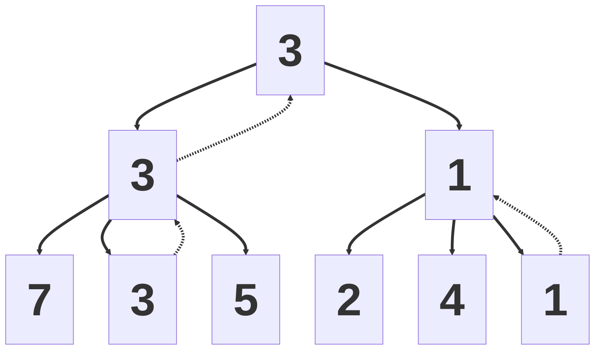
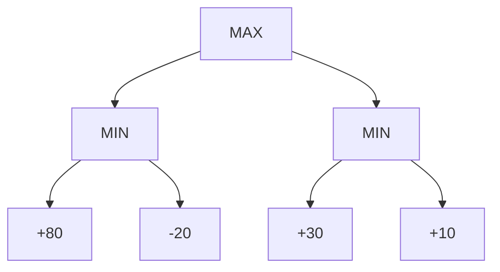
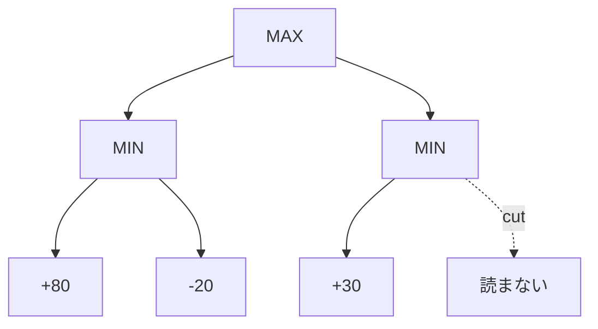
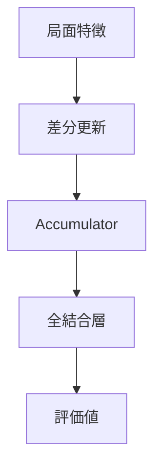
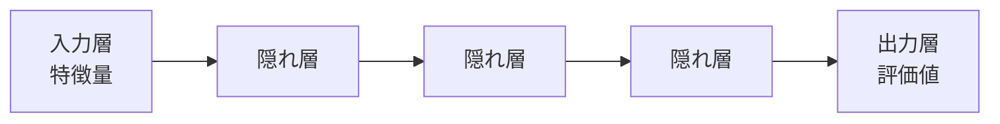
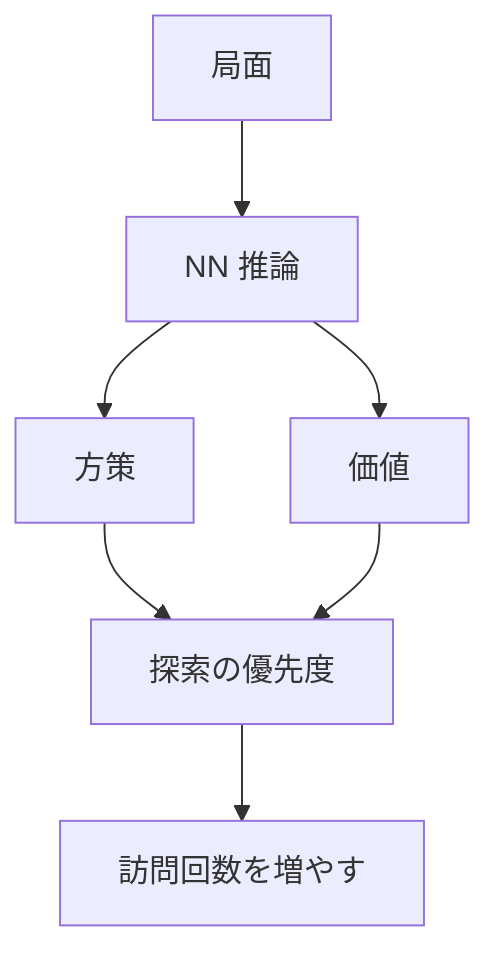
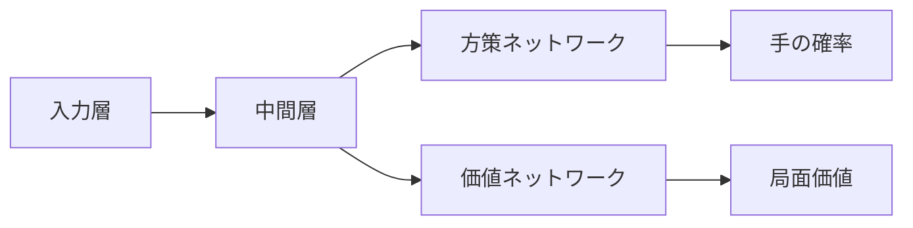

<div class="cover">
  <div class="eyebrow">第36回世界コンピュータ将棋選手権 1日目 お昼休憩 特別講演</div>
  <h1>将棋 AI の概要と最新動向</h1>
  <p class="subtitle">探索・評価関数・定跡から見るコンピュータ将棋</p>
  <div class="meta">
    <div>
      <div>野田 久順</div>
      <div class="muted">ザイオソフト コンピューター将棋サークル</div>
      <div class="muted">2026-05-03</div>
    </div>
  </div>
</div>

---
layout: section
---

# 1. 自己紹介

---
layout: image-right-framed
image: assets/S0650008697-0024-clipped-Hisayori-Noda.jpg
backgroundSize: contain
columns: 1.8fr 0.2fr
frameMaxWidth: 320px
frameMaxHeight: 280px
---

## 野田 久順

ザイオソフト <NW>コンピューター</NW><NW>将棋</NW><NW>サークル</NW><NW>所属</NW>

### 主な実績
- 2017年 <NW>第5回</NW><NW>将棋</NW><NW>電王</NW><NW>トーナメント</NW> <NW>優勝</NW>
- 2021年 <NW>CSA</NW><NW>貢献賞</NW> <NW>受賞</NW>
- 2024年 <NW>第34回</NW><NW>世界</NW><NW>コンピュータ</NW><NW>将棋</NW><NW>選手権</NW> <NW>優勝</NW>

---
layout: center
---

## 今日持ち帰ってほしいこと

1. <NW>将棋 AI の</NW><NW>全体像</NW><NW>（探索・</NW><NW>評価・</NW><NW>NNUE・</NW><NW>SFNN）</NW>
2. <NW>CPU エンジン</NW><NW>と</NW><NW>GPU エンジン</NW><NW>の</NW><NW>違い</NW>
3. <NW>定跡</NW><NW>と</NW><NW>最新動向</NW>

---
layout: two-cols
columns: 1fr 1fr
---

## この発表の流れ

::left::
- 1. <NW>自己紹介</NW>
- 2. <NW>将棋 AI の概要</NW>
  - ゲーム木
  - 探索量と複雑さ
  - 探索と評価

::right::
- 3. <NW>将棋 AI のアーキテクチャー</NW>
  - CPU エンジン
  - GPU エンジン
  - 定跡
- 4. <NW>最新動向</NW>
  - SFNN
  - 新ペタショック定跡

---
layout: section
---

# 2. 将棋 AI の概要

---
layout: image-right-framed
image: assets/2026-02-27-111526.png
backgroundSize: contain
columns: 1.3fr 0.7fr
frameMaxWidth: 280px
frameMaxHeight: 220px
---

## 将棋 AI とは

- <NW>将棋を</NW><NW>指す</NW><NW>ソフトウェア</NW>
- <NW>局面を</NW><NW>入力すると、</NW><NW>推奨手や</NW><NW>評価値を</NW><NW>提示</NW>
  - <NW>推奨手:</NW> <NW>次に</NW><NW>指すべき指し手</NW>
  - <NW>評価値:</NW> <NW>先手・後手の</NW><NW>有利さを</NW><NW>示す</NW><NW>数値</NW>

::right::
[ShogiHome](https://sunfish-shogi.github.io/shogihome/)

---
layout: two-cols
class: game-tree
columns: 1.3fr 0.7fr
---

## ゲーム木

::left::
- <NW>合法手に</NW><NW>基づいて、</NW><NW>局面遷移を</NW><NW>木構造で</NW><NW>表したもの</NW>
- <NW>ゲームの</NW><NW>状態遷移を</NW><NW>原理的に</NW><NW>すべて</NW><NW>表現できる</NW>
- <NW>すべての</NW><NW>分岐を</NW><NW>調べ切ると、</NW><NW>最善手同士の</NW><NW>結果を</NW><NW>特定できる</NW>
- <NW>この</NW><NW>過程を</NW><NW>「ゲームを解く」</NW><NW>と呼ぶ</NW>

::right::

```mermaid
%%{init: {'flowchart': {'useMaxWidth': true}}}%%
flowchart TD
  A@{ img: "./assets/image4.png", h: 110, constraint: "on" } --> B1@{ img: "./assets/image6.png", h: 110, constraint: "on" }
  A --> B2@{ img: "./assets/image5.png", h: 110, constraint: "on" }
  B1 --> C1@{ img: "./assets/image8.png", h: 110, constraint: "on" }
  B1 --> C2@{ img: "./assets/image7.png", h: 110, constraint: "on" }
  B2 --> C3[...]
  C1 --> D1@{ img: "./assets/image9.png", h: 110, constraint: "on" }
  C1 --> D2@{ img: "./assets/image10.png", h: 110, constraint: "on" }
  C2 --> D3[...]
  D1 --> E1[...]
  D2 --> E2[...]

  linkStyle default stroke-width:2px;
```

---
layout: two-cols
class: game-complexity
columns: 1.3fr 0.7fr
---

## 探索量から見たゲームの複雑さ

::left::
- <NW>ゲームを</NW><NW>解くための</NW><NW>探索局面数は、</NW><NW>複雑さの</NW><NW>目安になる</NW>
- <NW>探索局面数</NW><NW>≒</NW><NW>N<sup>M</sup></NW>
  - <NW>N:</NW><NW>平均合法手数</NW>
  - <NW>M:</NW><NW>平均終了手数</NW>
- <NW>複雑な</NW><NW>ゲームでは、</NW><NW>現実的な</NW><NW>時間内に</NW><NW>全探索は</NW><NW>不可能</NW>

::right::

| ゲーム | 探索局面数 |
| --- | --- |
| チェッカー | 10<sup>30</sup> |
| オセロ | 10<sup>60</sup> |
| チェス | 10<sup>120</sup> |
| 中国象棋 | 10<sup>150</sup> |
| 将棋 | 10<sup>220</sup> |
| 囲碁 | 10<sup>360</sup> |

---
layout: two-cols
class: search-eval
columns: 1.3fr 0.7fr
---

## 探索と評価

::left::
- <NW>一定の</NW><NW>手数まで</NW><NW>「探索」し、</NW><NW>到達局面を</NW><NW>「評価」する</NW>
  - <NW>探索:</NW> <NW>人間の</NW><NW>「読み」に</NW><NW>相当</NW>
  - <NW>評価:</NW> <NW>人間の</NW><NW>「大局観」に</NW><NW>相当</NW>

::right::



<div style="text-align:center; margin-top: 10px; font-size: 18px; line-height: 1.25">
  <NW>□:</NW> <NW>局面</NW><br>
  <NW>□の中の数字:</NW> <NW>評価値</NW><br>
  <NW>実線:</NW> <NW>差し手（遷移）</NW><br>
  <NW>破線:</NW> <NW>評価値の伝搬</NW><br>
  <NW>左側の</NW><NW>状態に</NW><NW>遷移する</NW><NW>手が</NW><NW>最善</NW><br>
  <NW>この時の</NW><NW>評価値は</NW><NW>3</NW>
</div>

---
layout: section
---

# 3. <NW>将棋 AI の</NW><NW>アーキテクチャー</NW>

---
layout: center
class: cpu-gpu
---

## CPU エンジンと GPU エンジン

| 項目 | CPUエンジン | GPUエンジン |
| --- | --- | --- |
| 探索アルゴリズム | アルファ・ベータ法 | PUCT |
| 評価関数 | <span class="next-focus">NNUE評価関数</span> | ディープラーニング評価関数 |
| 探索速度 | 速い | 遅い |
| 評価精度 | 低い | 高い |
| 特異な局面 | 終盤 | 序盤 |
| 主な将棋AI | やねうら王・水匠・tanuki- | dlshogi |

---
layout: section
---

# CPU エンジン

---
layout: two-cols
class: nnue
columns: 1fr 1fr
---

## ミニマックス法

::left::
- <NW>先手は</NW><NW>評価値の</NW><NW>最大化を</NW><NW>目指す手を</NW><NW>選択</NW>
  - <NW>先手:</NW> <NW>マックスプレイヤー</NW>
- <NW>後手は</NW><NW>評価値の</NW><NW>最小化を</NW><NW>目指す手を</NW><NW>選択</NW>
  - <NW>後手:</NW> <NW>ミニマムプレイヤー</NW>



::right::
### 図の意味
- <NW>先手:</NW> <NW>大きい</NW><NW>評価値を</NW><NW>選ぶ</NW>
- <NW>後手:</NW> <NW>小さい</NW><NW>評価値を</NW><NW>選ぶ</NW>
- <NW>終端接点:</NW> <NW>評価を</NW><NW>行った局面</NW>

---
layout: two-cols
columns: 1fr 1fr
---

## アルファ・ベータ法

::left::
- <NW>ミニマックス法と</NW><NW>同じ計算結果</NW>
- <NW>不要な探索の</NW><NW>枝刈り</NW>
- <NW>枝刈りの例</NW>
  - <NW>現在の</NW><NW>先手の</NW><NW>評価値は</NW> <NW>3</NW>
  - <NW>先手の</NW><NW>評価値の</NW><NW>更新には</NW> <NW>4</NW> <NW>以上の</NW><NW>評価値が</NW><NW>必要</NW>



::right::
### 枝刈りの例
- <NW>後手は</NW><NW>低い</NW><NW>評価値を</NW><NW>選択</NW>
- <NW>調査した</NW><NW>終端接点の</NW><NW>評価値は</NW> <NW>2</NW>
- <NW>後手の</NW><NW>評価値は</NW> <NW>2</NW> <NW>以下</NW>
- <NW>先手の</NW><NW>評価値は</NW><NW>更新されない</NW>
- <NW>この枝の</NW><NW>探索打ち切りが</NW><NW>可能</NW>

---
layout: two-cols
columns: 1fr 1fr
---

## NNUE 評価関数

::left::
- <NW>2018年</NW> <NW>那須悠</NW> <NW>氏により</NW><NW>発表</NW>
- <NW>ディープラーニングによる</NW><NW>評価関数</NW>
- <NW>CPU による</NW><NW>高速な推論</NW>
- <NW>全結合ニューラルネットワーク</NW>
- <NW>活性関数は</NW> <NW>clipped ReLU</NW>
- <NW>差分計算による</NW><NW>効率化</NW>
- <NW>手番の</NW><NW>考慮</NW>
- <NW>HalfKP</NW><NW>特徴量</NW>
- <NW>整数 SIMD 演算による</NW><NW>高速化</NW>

::right::


---
layout: two-cols
columns: 1fr 1fr
---

## 全結合ニューラルネットワーク

::left::
<NW>隠れ層</NW> <NW>3</NW> <NW>層程度の</NW><NW>浅い</NW><NW>ディープラーニング</NW>



::right::
### NNUE で使われる構成
- <NW>入力層:</NW> <NW>特徴量</NW>
- <NW>隠れ層:</NW> <NW>全結合層</NW>
- <NW>出力層:</NW> <NW>評価値</NW>

---
layout: image-right-framed
image: assets/HalfKP.png
backgroundSize: contain
columns: 1.35fr 0.65fr
frameMaxWidth: 440px
frameMaxHeight: 330px
---

## HalfKP 特徴量

- <NW>将棋盤面を</NW><NW>表す</NW><NW>数値ベクトル</NW>
- <NW>玉の位置</NW><NW>と</NW><NW>玉以外の</NW> <NW>1</NW> <NW>駒の</NW><NW>位置と種類の</NW><NW>組み合わせを</NW><NW>One-hot encoding</NW><NW>し、</NW><NW>加算</NW>
- <NW>81 × 1548 =</NW> <NW>125,388</NW> <NW>次元の</NW><NW>ベクトル</NW>

<div class="halfkp-caption">
<NW>玉と</NW><NW>玉以外の</NW><NW>駒 1 つの</NW><NW>組み合わせの</NW><NW>例</NW><br>
<NW>盤面上に</NW><NW>存在する</NW><NW>すべての</NW><NW>組み合わせを</NW><NW>One-hot encoding</NW><NW>したものを</NW><NW>足し合わせる</NW>
</div>

---
layout: section
---

# GPU エンジン

---
layout: two-cols
columns: 1fr 1fr
---

## GPU エンジンの探索アルゴリズム

::left::
<NW>PUCT</NW>

- <NW>モンテカルロ木探索に</NW><NW>基づく探索</NW>
- <NW>評価関数が</NW><NW>出力する</NW><NW>勝率と</NW><NW>着手の確率を</NW><NW>使う</NW>
- <NW>勝率</NW><NW>・</NW><NW>着手の確率</NW><NW>・</NW><NW>探索回数の少なさ</NW><NW>を</NW><NW>組み合わせる</NW>

::right::


---
layout: two-cols
columns: 1fr 1fr
---

## PUCT

::left::
- <NW>以下の式が</NW><NW>最大となる手を</NW><NW>選択</NW>

`Q(s,a) + c P(s,a) sqrt(N(s)) / (1 + N(s,a))`

- <NW>s:</NW> <NW>局面</NW>
- <NW>a:</NW> <NW>着手</NW>
- <NW>Q(s,a):</NW> <NW>局面 s における</NW><NW>着手 a の</NW><NW>勝率</NW>
- <NW>P(s,a):</NW> <NW>着手の確率</NW>
- <NW>N(s,a):</NW> <NW>s における a の</NW><NW>訪問回数</NW>

::right::
### 評価関数が出力するもの
- <NW>Q:</NW> <NW>勝率</NW>
- <NW>P:</NW> <NW>着手の確率</NW>

### 探索で足されるもの
- <NW>探索回数の</NW><NW>少なさ</NW>

---
layout: two-cols
columns: 1fr 1fr
---

## GPU エンジンの評価関数

::left::
- <NW>畳み込みニューラルネットワーク</NW><NW>（CNN）を</NW><NW>使用</NW>
- <NW>画像認識などで</NW><NW>用いられる</NW><NW>一般的手法の</NW><NW>応用</NW>
- <NW>局面を</NW><NW>複数の</NW><NW>画像に</NW><NW>変換して</NW><NW>入力</NW>
- <NW>中間層は</NW> <NW>ResNet</NW>
- <NW>出力層は</NW><NW>着手確率と</NW><NW>勝率を</NW><NW>出力</NW>

::right::


---
layout: two-cols
columns: 1fr 1fr
---

## GPU エンジンのネットワーク例

::left::
### 入力層
- <NW>局面を</NW><NW>画像に</NW><NW>変換して</NW><NW>入力</NW>
- <NW>駒の種類ごとに</NW> <NW>2</NW> <NW>値画像を</NW><NW>作成</NW>
- <NW>駒があるマス:</NW> <NW>白（1）</NW>
- <NW>駒がないマス:</NW> <NW>黒（0）</NW>
- <NW>持ち駒の種類ごとに</NW><NW>最大枚数分の</NW><NW>画像を</NW><NW>用意</NW>
- <NW>合計</NW> <NW>104</NW> <NW>枚の画像として</NW><NW>入力</NW>

### 中間層
- <NW>ResNet</NW><NW>（Residual Network）</NW>
- <NW>ネットワークの</NW><NW>深層化に</NW><NW>強い構造</NW>
- <NW>層をスキップする</NW><NW>ショートカット接続の</NW><NW>導入</NW>

::right::
### 方策ネットワーク
- <NW>着手確率を</NW><NW>出力</NW>
- <NW>指し手の表現は</NW><NW>移動先 × 移動方向の</NW><NW>組み合わせ</NW>
- <NW>出力層は</NW><NW>フィルターサイズ</NW> <NW>1×1</NW><NW>、</NW><NW>フィルター数</NW> <NW>27</NW> <NW>の畳み込み層</NW>

### 価値ネットワーク
- <NW>勝率を</NW><NW>出力</NW>
- <NW>出力層は</NW><NW>1×1 フィルター・27 チャネルの畳み込み層</NW>
- <NW>ユニット数</NW> <NW>256</NW> <NW>の全結合層</NW>
- <NW>ユニット数</NW> <NW>1</NW> <NW>の全結合層</NW>

---
layout: two-cols
columns: 1fr 1fr
---

## 定跡

::left::
- <NW>局面と</NW><NW>その局面における</NW><NW>指し手の</NW><NW>リスト</NW>
- <NW>定跡の役割</NW>
  - <NW>序盤の</NW><NW>思考時間を</NW><NW>節約</NW>
  - <NW>評価関数の</NW><NW>精度の悪さを</NW><NW>補助</NW>
  - <NW>有利な局面への</NW><NW>誘導</NW>

::right::

### 例

- <NW>☗２六歩</NW> <NW>96%</NW>
- <NW>☗７六歩</NW> <NW>2%</NW>
- <NW>...</NW>

---
layout: two-cols
columns: 1fr 1fr
---

## 定跡 2010 年代

::left::
### 2010 年代前半
- <NW>手動入力による</NW><NW>構築</NW>
- <NW>プロ棋士の</NW><NW>棋譜からの</NW><NW>生成</NW>
- <NW>floodgate の</NW><NW>棋譜からの</NW><NW>自動抽出</NW>

::right::
### 2010 年代後半
- <NW>自己対局による</NW><NW>定跡生成</NW>
- <NW>勝率に基づく</NW><NW>選別</NW>
- <NW>評価値に基づく</NW><NW>選別</NW>
- <NW>定跡データベース末端局面の</NW><NW>評価値による</NW><NW>ミニマックス処理</NW>

---
layout: two-cols
columns: 1fr 1fr
---

## 定跡 2020 年代

::left::
### 2020 年代前半
- <NW>自己対局結果による</NW><NW>定跡の自動修正</NW>
- <NW>不利な手順の</NW><NW>削除・置換</NW>
- <NW>有利な手順の</NW><NW>強化・拡張</NW>
- <NW>代表例:</NW> <NW>角換わり水匠定跡</NW>

::right::
### 2020 年代後半
- <NW>？？？</NW>

---
layout: section
---

# 4. 最新動向

---
layout: image-right-framed
image: assets/SFNNv9_architecture_detailed_v2.Bw_vbb_h.svg
class: sfnn
backgroundSize: contain
columns: 1fr 1fr
frameMaxWidth: 520px
frameMaxHeight: 360px
---

## SFNN

- <NW>Stockfish</NW> <NW>チームによる</NW><NW>改良版</NW>
  - <NW>Stockfish:</NW> <NW>世界最強の</NW><NW>チェス</NW> <NW>AI</NW>
- <NW>HalfKAv2_hm</NW> <NW>特徴量</NW>
- <NW>Full_Threats</NW> <NW>特徴量</NW>
- <NW>Feature Transformer</NW> <NW>の一部の直接出力</NW>
- <NW>LayerStack</NW>
- <NW>Element-wise</NW> <NW>multiply</NW>
- <NW>SqrClippedReLU</NW>

[NNUE | Stockfish Docs](https://official-stockfish.github.io/docs/nnue-pytorch-wiki/docs/nnue.html){.sfnn-link}

---
layout: two-cols
columns: 1fr 1fr
---

## 新ペタショック定跡

::left::
やねうら王チーム周辺で公開・配布されている、大規模な将棋定跡。

### 近年の特徴
- 数百万局面規模
- 1局面を大きなノード数で探索
- 定跡ツリーを minimax 的に整理

::right::
### 何が新しいか
- 次に掘る frontier nodes を選ぶ
- 自分番は bestmove を選ぶ前提にする
- 相手番は評価差の範囲で複数手を許す

組み合わせ爆発を抑えながら、実戦で出やすい深い変化を掘る。

---
layout: two-cols
columns: 1fr 1fr
---

## 最新動向を一言で

::left::
### 評価関数
- CPU: NNUE / SFNN 系の大型化
- GPU: 方策・価値ネットワークの高精度化
- 速度と精度の両立が中心課題

::right::
### 探索と定跡
- 探索は「全部読む」から「読むべき所を読む」へ
- 定跡は人間の知識から大規模探索結果へ
- 大会では定跡運用も重要な戦略

---
layout: section
---

# 5. まとめ

---
layout: center
---

## まとめ

1. <NW>将棋 AI</NW> は <NW>探索</NW> と <NW>評価</NW> を組み合わせて手を選ぶ
2. <NW>CPU エンジン</NW> はアルファ・ベータ探索と NNUE が中心
3. <NW>GPU エンジン</NW> は PUCT と方策・価値ネットワークが中心
4. 最新動向は <NW>SFNN</NW> と <NW>大規模定跡</NW> が見どころ

---
layout: center
---

## 参考

- コンピュータ将棋協会: 第36回世界コンピュータ将棋選手権 日程
- やねうら王公式: 新ペタショック定跡の定跡生成アルゴリズムについて
- やねうら王 GitHub / Wiki: エンジン種別と NNUE 系・DL 系の説明
- Stockfish NNUE PyTorch docs: NNUE と SFNN 系アーキテクチャー

---
layout: end
---

# ご清聴ありがとうございました
